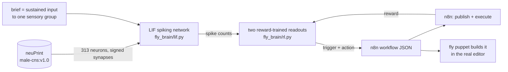

# bugflow

**I trained a fruit fly to design n8n workflows.**

313 real neurons from the MaleCNS v1.0 *Drosophila* connectome (the looming
detectors LPLC2 and LC4 and the giant fiber escape neuron they drive) run as
a spiking network. Show the brain a brief, it spikes, a reward-trained
readout turns the spikes into an n8n **trigger node + action node**, and a
fly puppet clicks the result into the real n8n editor. Four briefs, four
correct workflows, 92% reward.

**Watch: [`fly-demo.mp4`](fly-demo.mp4)** (60 s). Left, the connectome
thinking; right, the fly building what it decided in the live n8n editor.
Same brain, same moment.

Prior art, same connectome, different games:
[Beat Saber](https://x.com/_lyraaaa_/status/2097527368919470162),
[Minecraft](https://x.com/evnsnclr/status/2095975490708291948),
[Doom](https://x.com/nftechie_/status/2096409780961059119).

## What is actually happening



- **The connectome is fixed.** Synapse counts and transmitter signs come
  straight from neuPrint; nothing inside the brain is trained. That is the
  same honest framing the Beat Saber / Doom posts use.
- **What learns** is a linear softmax readout on the brain's spike counts,
  one for the trigger and one for the action, updated with a three-factor
  rule: `W += lr * (reward - baseline) * (onehot - probs) ⊗ counts`. The
  `(reward - baseline)` term is the dopamine analogue.
- **Briefs** are four sentences ("When a form is submitted, POST it to an
  endpoint", "Every morning, put metrics in a sheet", "When an email
  arrives, save it to disk", "When a new RSS item appears, alert the team
  channel"), each delivered as a sustained stimulus to `LPLC2_L`, `LPLC2_R`,
  `LC4_L` or `LC4_R`. Palette: `webhook | scheduleTrigger | emailReadImap |
  rssFeedTrigger` x `httpRequest | googleSheets | readWriteFile | slack`.
- **Result** (`results/fly-learning-curve.png`): the real connectome reaches
  rolling reward 0.9 in ~500 episodes; a random stand-in network of the same
  size needs ~2,000. Both end 4/4.

Yes, it is a linear classifier on top of a dead bug. It is *my* linear
classifier on top of a dead bug.

## Repository layout

| Path | What |
|---|---|
| `fly_brain/lif.py` | Leaky integrate-and-fire network, dense numpy. `python -m fly_brain.test_lif` |
| `fly_brain/connectome.py` | `load_synthetic()` stand-in graph; `load_real()` pulls a subgraph from neuPrint with soma positions. `python -m fly_brain.test_connectome` (mocked, offline) |
| `fly_brain/rl.py` | `RewardModulatedReadout`, the only thing that learns. Self-check: `python -m fly_brain.rl` |
| `fly_brain/designer.py` | Training loop: briefs, palette, rewards; saves `results/fly-readout.npz` and exports `n8n/fly-designed/*.json` |
| `fly_brain/demo.py` + `demo.html` | The visual demo at http://localhost:8765: 3D connectome flashing, live votes, assembled workflow, n8n verdict. Owns the one brain simulation and broadcasts it (SSE) |
| `fly_brain/puppet.py` | Playwright fly that follows the demo's brain and builds each design in the real n8n editor |
| `fly_brain/bridge.py`, `lookup.py` | The untrained precursor: reflex bridge (looming -> giant fiber burst -> n8n webhook) and a neuPrint name checker |
| `n8n/fly-brain-workflow-portable.json` | Webhook receiver the bridge and the fly-designed webhook workflow POST to. Publish this one |
| `n8n/fly-brain-workflow.json` | Same, but logs each event to a file. Needs `NODE_FUNCTION_ALLOW_BUILTIN=fs`. Publish only one of the two |
| `n8n/fly-designed/` | The four workflows the trained fly designed (real-connectome run) |
| `results/` | Trained readout, learning curve, training logs, `plot_curve.py` |
| `scripts/make_video.sh` | Records viz + editor in parallel and stitches `fly-demo.mp4` |
| `Dockerfile`, `k8s/bridge.yaml` | Container + Deployment for the reflex bridge |

## Run it

Tested on macOS (Apple Silicon): Python 3.14, numpy 2.5, pandas 3.0,
neuprint-python 0.6.3, n8n 2.13.4, Node 26, Playwright Chromium, ffmpeg.
Everything is local and throwaway; n8n lives in `/tmp/bugflow-n8n`.

### 1. Setup

```bash
python3 -m venv .venv && .venv/bin/pip install -r requirements.txt playwright matplotlib
.venv/bin/python -m playwright install chromium
export NEUPRINT_TOKEN=<yours>          # https://neuprint.janelia.org -> account menu -> Auth Token (free)
export N8N_USER_FOLDER=/tmp/bugflow-n8n
export N8N_EMAIL=you@example.com N8N_PASSWORD='pick-one'   # for the local throwaway n8n only
```

Check the neuron names still resolve (MaleCNS naming differs from
hemibrain; the giant fiber's instance is `DNp01(GF)_L/R`, not `DNp01_L/R`):

```bash
.venv/bin/python -m fly_brain.lookup 'LPLC2_.*' 'LC4_.*' 'DNp01\(GF\)_.*'
```

### 2. Train the fly (about a minute)

```bash
.venv/bin/python -m fly_brain.designer --mode real       # 20k episodes -> results/fly-readout.npz, n8n/fly-designed/*.json
.venv/bin/python -m fly_brain.designer                   # optional: the synthetic control brain
.venv/bin/python results/plot_curve.py                   # optional: regenerate the learning curve
```

Expected tail: `greedy designs: 4/4 correct`. The repo ships a trained
`results/fly-readout.npz`, so you can skip this step.

### 3. Start n8n (terminal 1)

```bash
mkdir -p "$N8N_USER_FOLDER"
n8n import:workflow --separate --input=n8n/              # receiver workflows
n8n import:workflow --separate --input=n8n/fly-designed/ # the fly's designs
n8n publish:workflow --id=flyBrainEventsPortable
n8n publish:workflow --id=flyDesigned-form-to-endpoint
N8N_PORT=5680 n8n start
```

Then, once (fresh DB only), create the owner account:

```bash
curl -s -X POST http://localhost:5680/rest/owner/setup -H 'Content-Type: application/json' \
  -d "{\"email\":\"$N8N_EMAIL\",\"firstName\":\"Fruit\",\"lastName\":\"Fly\",\"password\":\"$N8N_PASSWORD\"}"
```

Port 5680, not 5679: n8n's task-runner broker sits on 5679 and answers
webhook POSTs with an HTML 404. The CLI import/publish commands need n8n
stopped; re-importing deactivates, so publish again afterwards.

### 4. Brain viz (terminal 2)

```bash
.venv/bin/python -m fly_brain.demo --fps 15        # http://localhost:8765
```

Left: the 313 neurons at their real soma coordinates, rotating, flashing
when they spike (sensory groups colored per brief, giant fiber white).
Right: the brief, the two readouts' votes filling in, the assembled
workflow, n8n's verdict, and a running score. This process owns the single
brain simulation; start it before the puppet.

### 5. The fly in the real editor (terminal 3)

```bash
.venv/bin/python -m fly_brain.puppet               # forever; --loops 4 for one pass, --pace 0.5 faster
```

A Chromium window opens on n8n. The puppet subscribes to the demo's event
stream, waits for the brain's decision, then a fly walks to the add-node
button, searches the picker, drops the trigger and the action, names the
workflow `Fly: <brief>` and saves. It narrates each step back to the viz
and acks so the brain waits for it before the next brief.

Only the webhook-triggered design executes live (`POST
/webhook/fly-form-to-endpoint`, which chains into the fly-brain receiver);
the other three need credentials and show "workflow JSON exported".

### 6. Record the video

```bash
scripts/make_video.sh 60 fly-demo.mp4              # with n8n + demo running; ~80 s
```

### Checks

```bash
.venv/bin/python -m fly_brain.test_lif
.venv/bin/python -m fly_brain.test_connectome
.venv/bin/python -m fly_brain.rl
sqlite3 $N8N_USER_FOLDER/.n8n/database.sqlite "SELECT status, COUNT(*) FROM execution_entity GROUP BY status;"
```

### Teardown

```bash
rm -rf /tmp/bugflow-n8n recordings
kubectl delete namespace bugflow        # if you did the k8s part
```

## The untrained precursor: reflex bridge

Before training there is a plain reflex loop: a metronome stimulates the
looming detectors, the giant fiber bursts, the bridge POSTs
`{"event":"motor_burst","neuron_group":"escape_dn","spike_rate":0.2,"step":122,"mode":"real"}`
to `/webhook/fly-brain`. It is what runs in the container.

```bash
N8N_WEBHOOK_URL=http://localhost:5680/webhook/fly-brain .venv/bin/python -m fly_brain.bridge \
  --mode real --sensory-groups '{"looming": ["LPLC2_.*", "LC4_.*"]}' \
  --motor-groups '{"escape_dn": "DNp01\\(GF\\)_.*"}' --weight-scale 1000 --steps 400
.venv/bin/python -m fly_brain.bridge --steps 150     # synthetic, no token needed
```

Every flag is also an env var (`FLY_*`, `N8N_WEBHOOK_URL`, `NEUPRINT_*`);
`--help` lists them. The ones that matter:

| Flag | Default | Meaning |
|---|---|---|
| `--mode` | `synthetic` | `synthetic` or `real` |
| `--steps` / `--step-delay` | `400` / `0` | `0` steps = forever; delay paces a long-running container |
| `--beat-every` | `12` | stimulus pulse every N steps |
| `--window`, `--rate-threshold`, `--cooldown` | `5`, `0.15`, `10` | motor burst detector |
| `--sensory-groups`, `--motor-groups` | none | real mode: JSON `{name: instance-regex or [regex, ...]}`; full-match against `<type>_<side>` |
| `--min-weight`, `--weight-scale` | `3`, `20` | real mode: drop weak edges; divide synapse counts |

**Calibrating `--weight-scale`** for a new circuit: run with no webhook and
read the `per motor group: ... spikes=N events=M` summary. Silent: halve
it. Firing every step: double it (real subgraphs are recurrent and can run
away; the GABA/glutamate/histamine signs are what bound them). For
LPLC2+LC4 -> GF: 20 and 100 saturate, 400 and 1000 give one burst per
beat, 3000 is silent. Use 1000.

### Container and Kubernetes

```bash
docker build -t bugflow-bridge:dev .
docker run --rm bugflow-bridge:dev --steps 30
kubectl -n bugflow create secret generic neuprint-token --from-literal=NEUPRINT_TOKEN="$NEUPRINT_TOKEN"
kubectl apply -f k8s/bridge.yaml && kubectl -n bugflow logs -f deploy/fly-brain-bridge
```

`k8s/bridge.yaml`: namespace, ConfigMap (all `FLY_*` settings), Deployment
(non-root, read-only rootfs, no capabilities, `replicas: 1` since each
replica is its own brain). Edit `image:` and `N8N_WEBHOOK_URL` (in-cluster:
`http://<svc>.<ns>.svc.cluster.local:5678/webhook/fly-brain`). Verified on
OrbStack's local k8s against a host n8n via `host.docker.internal`. Inside a
cluster, import and publish the receiver workflow through the n8n UI (the
CLI needs n8n stopped).

## Troubleshooting

| Symptom | Fix |
|---|---|
| `webhook HTTP 404 ... not registered` | workflow not published: `n8n publish:workflow --id=...` with n8n stopped |
| HTML `Cannot POST /webhook/...` | you hit the task-runner broker on 5679; use `N8N_PORT=5680` |
| `-> n8n 200:` with empty body | a node after the Webhook threw; check n8n Executions |
| `Module 'fs' is disallowed` | file-logging workflow without `NODE_FUNCTION_ALLOW_BUILTIN=fs`; use the portable one |
| `NOT NULL constraint failed: workflow_entity.id` | workflow JSON needs a top-level `id`; the bundled ones have it |
| `no events fired: network is silent` / thousands of spikes | `--weight-scale` calibration above |
| `warning: group 'x' matched no neurons` | regex is full-match: `LPLC2_.*`, not `LPLC2`; verify with `lookup` |
| `n8n login required` from the puppet | export `N8N_EMAIL` / `N8N_PASSWORD` |
| the two demo windows disagree | puppet started before `demo.py`; start the viz first |
| viz stuck on one brief for 2 min | a puppet died mid-build; it recovers after the 120 s ack timeout |
| `ModuleNotFoundError` | you ran `python3` instead of `.venv/bin/python` |

## Design notes and limits

- **LIF is minimal**: one `tau`, one `v_thresh`, no refractory period, one
  step synaptic delay, dense float64 (10k neurons = 800 MB; switch to
  `scipy.sparse` beyond that).
- **Transmitter sign is a heuristic**: GABA, glutamate, histamine
  inhibitory; everything else, including neuromodulators, excitatory.
- **Synthetic stand-in is feedforward**; a random recurrent signed graph
  either saturates or dies, so it is not a fair control for dynamics, only
  for learning speed.
- **Hyperparameters that mattered**: per-readout binary rewards (a readout
  is never blamed for the other's mistake), constant lr 1.0, constant
  epsilon 0.1, weight decay 1e-3. Hot or decaying lr froze at ~0.48 reward.
- **Puppet selectors** are n8n `data-test-id` hooks (`canvas-add-button`,
  `node-creator-search-bar`, `node-creator-item-name`, `canvas-handle-plus`,
  `ndv-close-button`, `workflow-name-input`), verified on n8n 2.13.4.
- **Not a closed loop**: briefs are a metronome. `stim()` in `bridge.py`
  and `Demo.episodes()` in `demo.py` are the two places to feed real input.

## License

MIT. The MaleCNS v1.0 data is fetched at runtime from neuPrint under its
own CC-BY license; nothing from it is redistributed here.
